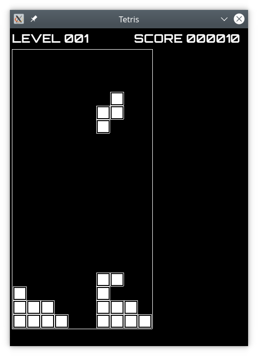

# Tetris SDL

Simple tetris game using SDL2

# Getting source code and building

1. Install prerequests:

    $ sudo apt install cmake gcc g++  binutils libsdl2-dev libsdl2-ttf-dev libsdl2-mixer-dev libfmt-dev

2. Get the source code from Github:
    
    $ git clone git@github.com:alexcrack/tetris-sdl.git
    
3. Run cmake

    $ mkdir tetris-sdl-build
    $ cd tetris-sdl-build
    
    $ cmake ../tetris-sdl
    
    $ make
